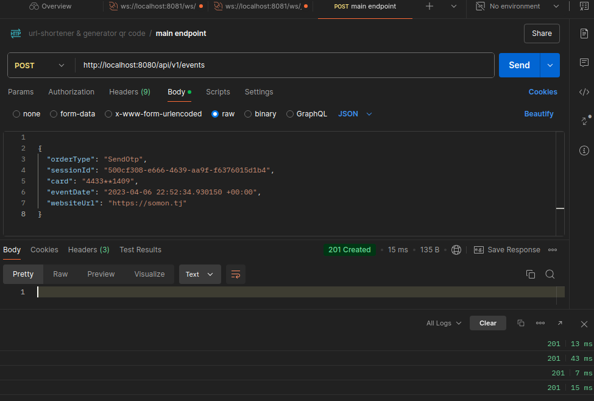
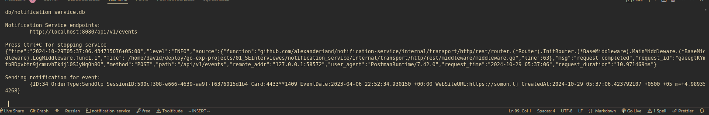
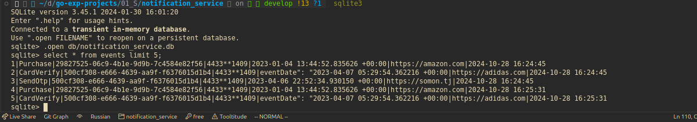

# Notification Service

### Project Description

> Notification Service is an HTTP service designed to receive card activity events in JSON format, store them in an SQLite database, and process and notify users of card events. The service is built on DDD + Clean Architecture principles to ensure code clarity and modularity.

### Architecture

> The service is developed using clean architecture principles (Clean Architecture) and the Go standard library. Events are stored in an SQLite3 database using github.com/mattn/go-sqlite3, and settings are parsed from local.yaml with gopkg.in/yaml.v2.

### Requirements

- Go 1.22+
- SQLite3
- Make for building and running the service
- Configuration
- Service configuration parameters are located in the local.yaml file:

### Configuration params: local.yaml

```yaml
env: "prod" #local, dev, prod

service:
  name: "notification-service"
  version: "v1.0.1"

http_server:
  rw_timeouts: 5 # in seconds
  idle_timeout: 30 # in seconds
  max_header_size: 3 # in megabytes
Environment variables are set in local.env:
```

### Environment Variables: local.env

```bash
export CONFIG_FILE_PATH=configs/local.yaml
export HTTP_SERVER_ADDR=localhost:8080
export DATABASE_FILE_PATH=db/notification_service.db
```

### Makefile

A `Makefile` is included to simplify building and running the project, with several available targets:

```Makefile
make        # Default: builds and runs the project
make fmt    # Code formatting
make lint   # Static code analysis
make test   # Run tests with coverage
make race   # Run tests with race condition detection
make build_and_run  # Build the binary and run it
```

## Running the Project

1. Clone the repository and navigate to the project directory.
    ```bash
    git clone git@github.com:alexanderiand/notification-service.git
    ```
2. Ensure all dependencies are installed, and the environment variables from local.env are set.
 **If you need to install `make` for linux, and Windows WSL (Windows Subsystem for Linux)**
  ```bash
    sudo apt update
    sudo apt install make
  ```
  For MacBook:
  ```bash
    brew install make
  ```

3. Run the project with:

```bash
make
```

#### The service will start on `http://localhost:8080` and be ready to receive events.

## Request Example

To send an event, perform a POST request:

**1. bash**
```bash
curl -X POST http://localhost:8080/api/v1/events \
-H "Content-Type: application/json" \
-d '{
  "orderType": "SendOtp",
  "sessionId": "500cf308-e666-4639-aa9f-f6376015d1b4",
  "card": "4433**1409",
  "eventDate": "2023-04-06 22:52:34.930150 +00:00",
  "websiteUrl": "https://somon.tj"
}'
```
**2. Postman**



## Logging and Notifications

**Upon sending an event, the following will be printed in the console:**

**1. request log by middleware, `json`:**
```json
{
  "time":"2024-10-29T05:06:57.42342775+05:00",
  "level":"INFO",
  "msg":"request completed",
  "method":"POST",
  "path":"/api/v1/events",
  "request_duration":"8.679689ms"
}
```
**2. Terminal output, with middleware log:**



### Notification, terminal output as plain text:

```terminal
Sending notification for event: {OrderType:SendOtp, SessionID:500cf308, Card:4433**1409, ...}
```

## Event Storage (SQLite3):

### Events are stored in an SQLite3 database




## License

***This project is distributed under the MIT License.***
